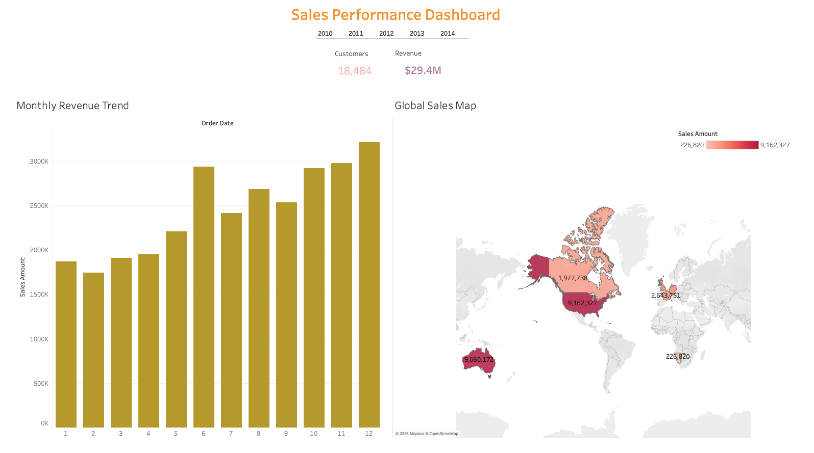
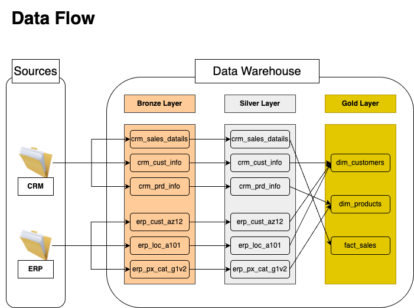

# Sales Data Warehouse — Analytics Engineering Platform

End-to-end analytics platform integrating CRM and ERP sales data
into a Star Schema gold layer, then exposed through a semantic
layer and an interactive Tableau dashboard.


---

## Live Demo



Interactive Year filter drives the KPIs, monthly trend, and global
map in sync. `bi/sales_performance.twbx` is checked in — open in
Tableau Desktop to interact.

---

## What this project delivers

Five layers each replacing a real production concern, every layer
backed by a single commit message in `git log`:

| Layer | Tool | Solves |
|---|---|---|
| **Modeling** | dbt incremental + `dim_customers` snapshot (SCD2) + B-tree indexes on FK/watermark | "Every nightly run rebuilds the world" + "we lost customer history" |
| **Orchestration** | Dagster asset DAG + hourly schedule + file sensor + asset checks + `RetryPolicy(max_retries=3, exponential)` | "Pipeline runs manually, fails silently" |
| **Observability** | Elementary anomaly tests (volume / null / freshness) on the marts + `edr monitor` + Slack | "We notice broken reports from end-users, not monitoring" |
| **Semantic** | dbt Semantic Layer (MetricFlow) — 5 business metrics (`total_revenue`, `aov`, `customer_count`, `revenue_per_customer`, `order_count`) | "Every BI tool computes revenue slightly differently" |
| **BI** | Tableau Desktop dashboard (`.twbx` packaged) reading the gold marts directly | "Analysts wait on engineers for every report" |

---

## Architecture

Three-layer **medallion architecture** (bronze → silver → gold) with
Dagster orchestrating, Elementary observing, MetricFlow defining
business metrics, and Tableau consuming.



---

## Tech stack

| Layer | Stack |
|---|---|
| Transformation | dbt Core 1.11 |
| Storage | PostgreSQL 16, SQL Server |
| Orchestration | Dagster 1.13 |
| Observability | Elementary 0.25 + Slack webhook |
| Semantic Layer | dbt-metricflow 0.13 |
| BI | Tableau Desktop |
| Infra | Docker Compose, GitHub Actions |

---

## Quick Start

```bash
# 1. First-time setup (docker + venv + python deps + dbt deps)
make setup
cp .env.example .env && direnv allow .   # then edit credentials

# 2. Build the full pipeline (seeds + models + snapshot + tests)
make build

# 3. Push any pending Elementary alerts to Slack + generate HTML report
make observability
make report

# 4. Open Dagster UI for orchestration
make dagster                              # :3000
```

Run `make help` for the full list of targets.

---

## Project structure

```
sql-data-warehouse-project/
|-- bi/
|   `-- sales_performance.twbx           Tableau workbook (4 charts + Year filter)
|
|-- dagster_project/                     Dagster orchestration (@dbt_assets + schedule + sensor + asset checks)
|
|-- dbt_project/
|   |-- models/
|   |   |-- staging/                     6 silver models (dedup, type casting)
|   |   |-- marts/                       dim_customers, dim_products, fact_sales
|   |   `-- semantic/                    MetricFlow semantic models + metrics
|   |-- snapshots/                       dim_customers_snapshot (SCD2)
|   `-- tests/                           singular tests (FK integrity, etc.)
|
|-- scripts/
|   |-- simulator/                       Daily ingestion simulator (Python)
|   |-- benchmark/                       fact_sales perf benchmark (bash + SQL)
|   `-- {bronze,silver,gold,tests}/      Legacy T-SQL implementation
|
|-- docs/
|   |-- architecture/                    5 architecture diagrams
|   `-- screenshots/                     UI captures for this README
|
|-- datasets/                            Read-only raw CSV archive
`-- docker-compose.yml                   PostgreSQL
```

---

## Data quality

Three layers of checks before data reaches BI:

| Layer | Run via | Catches |
|---|---|---|
| **dbt tests** (20+) | `dbt test` | Schema-level: `unique`, `not_null`, FK integrity, business rules (e.g. `sales = quantity * abs(price)`) |
| **Elementary** (5) | `dbt build` | Statistical anomalies: row count drops, null-rate spikes, average drift (z-score over rolling baseline) |
| **Dagster asset checks** (4) | After each materialization | Operational health: row count > 0 (ERROR), freshness ≤ 14 days (WARN) |

---

## Legacy: dual T-SQL implementation

The original `scripts/` directory implements the same pipeline in
T-SQL stored procedures against SQL Server. Kept side-by-side to make
the dbt migration's trade-offs explicit:

| | SQL Server (`scripts/`) | dbt + PostgreSQL (`dbt_project/`) |
|---|---|---|
| **Bronze** | `BULK INSERT` stored procedure | `dbt seed` |
| **Silver** | T-SQL stored procedures | dbt staging models (`ref()` lineage) |
| **Gold** | `CREATE VIEW` (Star Schema) | dbt mart models (table) |
| **Tests** | Manual SQL scripts | `dbt test` (generic + singular + Elementary) |
| **Lineage** | None | Auto-generated DAG (dbt + Dagster) |
| **Orchestration** | None | Dagster |
| **Infra** | Requires SQL Server | `docker compose up -d` |
