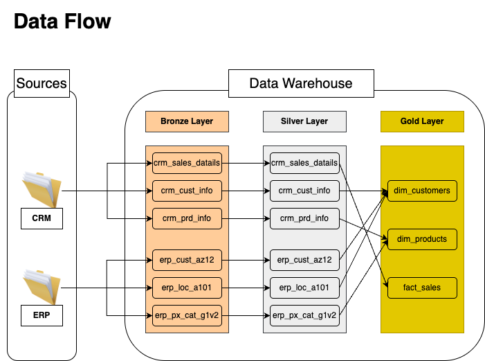

# Sales Data Warehouse — Medallion Architecture

End-to-end data warehouse that integrates CRM and ERP sales data (11,000+ customers, 60,000+ transactions) into a Star Schema analytics layer, implemented in **two approaches**:

| | SQL Server | dbt + PostgreSQL |
|---|---|---|
| **Directory** | `scripts/` | `dbt_project/` |
| **Bronze** | `BULK INSERT` stored procedure | `dbt seed` |
| **Silver** | T-SQL stored procedures | dbt staging models |
| **Gold** | `CREATE VIEW` (Star Schema) | dbt mart models |
| **Tests** | Manual SQL scripts | `dbt test` (generic + singular) |
| **Infra** | Requires SQL Server | `docker compose up -d` |

---

## Architecture Overview

**Medallion Architecture** with three layers:

1. **Bronze** — Raw ingestion from 6 CSV source files (3 CRM + 3 ERP), no transformation
2. **Silver** — Data cleansing, deduplication, standardization, and type conversion
3. **Gold** — Star Schema with `dim_customers`, `dim_products`, and `fact_sales`

### Data Flow (applies to both implementations)



### SQL Server Implementation


### dbt + PostgreSQL Implementation


*DAG generated by `dbt docs` — shows model dependencies and data lineage*

---

## Data Integration

Two source systems with different schemas and data quality issues are integrated into a unified model:


| Source | Tables | Key Data |
|--------|--------|----------|
| **CRM** | `cust_info`, `prd_info`, `sales_details` | Customer master, product catalog, transactions |
| **ERP** | `CUST_AZ12`, `LOC_A101`, `PX_CAT_G1V2` | Demographics, location, product categories |

---

## Data Model (Gold Layer)


---

## Key Transformations (Silver Layer)

| Transformation | Technique | Example |
|---------------|-----------|---------|
| **Deduplication** | `ROW_NUMBER() OVER (PARTITION BY ... ORDER BY ... DESC)` | Keep most recent customer record per `cst_id` |
| **Date derivation** | `LEAD()` window function | Compute product `end_date` from next version's `start_date` |
| **Date parsing** | Integer → Date conversion | `20101229` → `2010-12-29`, with validation for invalid/zero values |
| **Cross-validation** | Conditional recalculation | If `sales != qty * price`, recalculate from available values |
| **Standardization** | `CASE WHEN` mapping | Gender codes (`M`/`F`/`MALE`/`FEMALE`) → `Male`/`Female`/`N/A` |
| **Multi-source merge** | `COALESCE` with priority | CRM gender preferred over ERP gender when available |
| **Data cleaning** | `TRIM`, `REPLACE`, `REGEXP_REPLACE` | Strip carriage returns, normalize country codes (`DE` → `Germany`) |

---

## Data Quality Tests

**Silver layer** — 8 singular tests + generic tests (unique, not_null, accepted_values):
- No duplicate/null primary keys after dedup
- No untrimmed whitespace in string fields
- No negative costs, no invalid date ranges
- Sales formula consistency: `sales = quantity * price`
- Birthdates within valid range (1924 – today)

**Gold layer** — Referential integrity:
- All `fact_sales` records link to valid `dim_customers` and `dim_products`
- Surrogate keys are unique and non-null

---

## Quick Start (dbt + PostgreSQL)

**Prerequisites**: Docker, Python 3.9+

```bash
# Start PostgreSQL
docker compose up -d

# Set up Python environment
python3 -m venv venv
source venv/bin/activate
pip install -r requirements.txt

# Run the full pipeline
cd dbt_project
dbt deps --profiles-dir .
dbt seed --profiles-dir .       # Bronze: load CSVs
dbt run --profiles-dir .        # Silver + Gold: transform
dbt test --profiles-dir .       # Run all data quality tests

# View auto-generated documentation & DAG
dbt docs generate --profiles-dir .
dbt docs serve --profiles-dir .
```

---

## Project Structure

```
├── datasets/                    # Source CSV files
│   ├── source_crm/              #   CRM: customers, products, sales
│   └── source_erp/              #   ERP: demographics, location, categories
│
├── scripts/                     # SQL Server implementation
│   ├── init_database.sql        #   Create database & schemas
│   ├── bronze/                  #   DDL + BULK INSERT procedure
│   ├── silver/                  #   DDL + transformation procedure
│   ├── gold/                    #   Star Schema views
│   └── tests/                   #   Data quality checks
│
├── dbt_project/                 # dbt + PostgreSQL implementation
│   ├── seeds/                   #   Bronze: CSV files for dbt seed
│   ├── models/
│   │   ├── staging/             #   Silver: 6 transformation models
│   │   └── marts/               #   Gold: dim_customers, dim_products, fact_sales
│   └── tests/                   #   Data quality checks
├── docs/                        # Architecture & data model diagrams
├── docker-compose.yml           # PostgreSQL container
└── requirements.txt             # Python dependencies
```

---

## Tech Stack

- **SQL Server** — T-SQL, Stored Procedures, Window Functions (`ROW_NUMBER`, `LEAD`), CTEs
- **PostgreSQL 16** — via Docker
- **dbt Core** — Models, Sources, Seeds, Generic & Singular Tests, Documentation
- **Docker** — Containerized database for reproducibility
- **Git** — Version control
